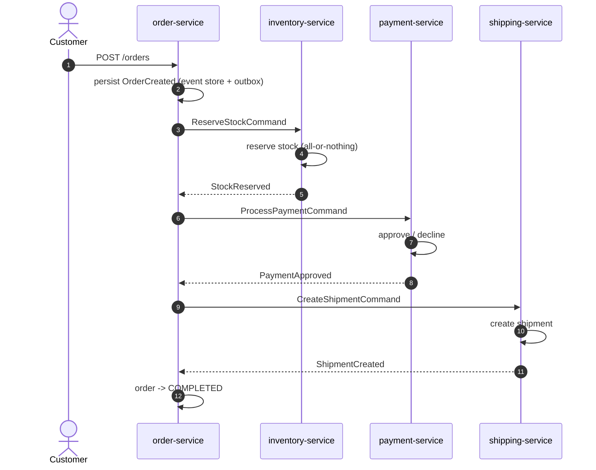

# orbit-commerce

Event-driven e-commerce **showcase** built with Java 21, Spring Boot 4, Go,
Apache Kafka and Docker. Not a real product — a hands-on demonstration of an
orchestrated Saga, the Transactional Outbox pattern, Event Sourcing + CQRS,
Kafka Streams analytics, and a full observability stack, all wired together
across 6 independently deployable services.

## What it does

A customer places an order (`POST /orders`). `order-service` orchestrates a
**Saga** across three participant services — reserve stock, charge payment,
create a shipment — each communicating asynchronously over Kafka. If any
step fails, `order-service` triggers **compensating actions** (release
stock, refund payment) to unwind whatever already succeeded, so the system
never ends up in a half-completed state.



Every arrow between services is a Kafka message (Avro-encoded, published
through each service's own Outbox table — never a direct, un-tracked
`send()`). If `inventory-service` rejects the reservation, `payment-service`
declines the charge, or `shipping-service` fails to create the shipment,
`order-service` reacts by publishing the matching compensation command(s)
instead of moving forward:

| Failure point | Compensation | Order ends as |
|---|---|---|
| Stock rejected | *(nothing to undo yet)* | `CANCELLED` |
| Payment declined | `ReleaseStockCommand` | `CANCELLED` |
| Shipment failed | `RefundPaymentCommand` **+** `ReleaseStockCommand` | `FAILED` |

Meanwhile, `query-service` independently consumes every `*.events` topic to
build a read-only, cross-service **timeline** per order (CQRS), and runs a
**Kafka Streams** topology counting product views in real time from
simulated shopper traffic produced by `ingestion-service` (Go).

## Services

| Service | Language | Port | Responsibility |
|---|---|---|---|
| `order-service` | Java 21 / Spring Boot 4 | `8082` | Saga orchestrator; event-sourced `Order` aggregate |
| `inventory-service` | Java 21 / Spring Boot 4 | `8083` | Stock reservation / release |
| `payment-service` | Java 21 / Spring Boot 4 | `8084` | Payment approval / decline / refund |
| `shipping-service` | Java 21 / Spring Boot 4 | `8085` | Shipment creation |
| `query-service` | Java 21 / Spring Boot 4 | `8086` | CQRS read model + Kafka Streams analytics |
| `ingestion-service` | Go | `8090` | Simulated high-volume shopper activity producer |
| `event-schemas` | Java (Avro) | — | Shared Avro schemas for every Kafka topic (library module) |
| `outbox-support` | Java | — | Shared Transactional Outbox implementation (library module) |

### Patterns used, and where

- **Saga (orchestration)** — `order-service` is the only orchestrator;
  every other service is a participant that reacts to commands and replies
  with events, never talking to another participant directly.
- **Transactional Outbox** — every service that publishes to Kafka
  (order/inventory/payment/shipping) writes to its own `outbox` table in
  the *same* database transaction as its domain change, then a
  `@Scheduled` poller publishes pending rows to Kafka and marks them
  published — no dual-write, no lost messages on a crash mid-publish.
  Shared implementation lives in `outbox-support`.
- **Event Sourcing** — `order-service`'s `Order` aggregate has no mutable
  columns of its own; its current state is *derived* by replaying its full
  history of domain events from the `order_events` table.
- **CQRS** — `query-service` never writes to the Saga; it only consumes
  events and maintains its own denormalized read models
  (`timeline_entries`, `order_summaries`) for fast queries.
- **Kafka Streams** — `query-service` also runs a tumbling-window
  (1-minute) topology counting `ProductViewed` events per product,
  queryable interactively via `GET /analytics/top-products`.

## Repository layout

```
orbit-commerce/
├── docker-compose.yml          # infra (default) + all 6 apps + observability (apps profile)
├── event-schemas/              # Avro .avsc schemas, shared by every JVM service
├── outbox-support/             # shared Outbox pattern implementation (JVM library)
├── order-service/              # Saga orchestrator
├── inventory-service/          # Saga participant
├── payment-service/            # Saga participant
├── shipping-service/           # Saga participant
├── query-service/              # CQRS read model + Kafka Streams
├── ingestion-service/          # Go — simulated shopper traffic producer
├── infra/
│   ├── kafka/init-topics.sh
│   ├── postgres/init-databases.sh
│   ├── prometheus/prometheus.yml
│   └── grafana/provisioning/   # datasource + dashboards, auto-loaded
├── scripts/                    # env-up.ps1 / env-down.ps1 / env-logs.ps1
├── docs/decisions.md           # full technical decisions log, per phase
└── TASKS.md                    # phase-by-phase implementation checklist
```

## Prerequisites

- JDK 21
- Docker Desktop (Compose v2)
- Go 1.22+ (only needed to run `ingestion-service`)
- PowerShell (the helper scripts under `scripts/` are `.ps1`)

## Quick start

There are two ways to run this project: **infra-only** (fastest, services
run on your host via Gradle) or **fully dockerized** (everything, including
Prometheus/Grafana, in containers). Both use the same `docker-compose.yml`.

### Option A — infra in Docker, services on the host (fastest inner loop)

1. **Bring up the infrastructure** (Kafka, Schema Registry, Postgres, Kafka UI):
   ```powershell
   .\scripts\env-up.ps1
   ```
   Wait for it to report healthy — this creates all 8 Kafka topics and the
   5 Postgres databases automatically on first run.

2. **Run each Java service** in its own terminal (each picks up its own
   `application.properties`, defaulting to `localhost` for everything):
   ```powershell
   .\gradlew.bat :order-service:bootRun
   .\gradlew.bat :inventory-service:bootRun
   .\gradlew.bat :payment-service:bootRun
   .\gradlew.bat :shipping-service:bootRun
   .\gradlew.bat :query-service:bootRun
   ```

3. **(Optional) Run the Go traffic generator**, in its own terminal:
   ```powershell
   cd ingestion-service
   go run ./cmd/ingestion-service
   ```

4. **Seed some stock**, then place an order:
   ```powershell
   Invoke-RestMethod -Method Post http://localhost:8083/stock `
     -ContentType "application/json" `
     -Body '{"productId":"sku-1","quantity":100}'

   Invoke-RestMethod -Method Post http://localhost:8082/orders `
     -ContentType "application/json" `
     -Body '{"customerId":"cust-1","items":[{"productId":"sku-1","quantity":2,"unitPriceCents":1500}]}'
   ```

5. **Watch it flow**, using the `id` returned above:
   ```powershell
   Invoke-RestMethod http://localhost:8082/orders/<id>              # order-service's own view
   Invoke-RestMethod http://localhost:8086/orders/<id>/timeline      # query-service's cross-topic timeline
   ```
   Or inspect it visually in **Kafka UI** (http://localhost:8080).

6. **Tear down** when done:
   ```powershell
   .\scripts\env-down.ps1          # add -Volumes to also wipe Postgres/Kafka data
   ```

### Option B — everything dockerized (services + observability stack)

Brings up the 5 Java services (built from source via multi-stage
Dockerfiles) plus Prometheus, Grafana, and kafka-exporter, all on the same
Docker network — no `localhost` juggling needed.

```powershell
.\scripts\env-up.ps1 -Apps -Build
```

Equivalent to `docker compose --profile apps up -d --build` — the plain
`docker compose up -d` / `.\scripts\env-up.ps1` (no `-Apps`) command still
brings up **only** the infra, unchanged.

Once up:

| Tool | URL |
|---|---|
| Prometheus | http://localhost:9090 (check `/targets` — all 5 services should show `UP`) |
| Grafana | http://localhost:3000 (`admin` / `admin`) — 3 dashboards pre-provisioned |
| Kafka UI | http://localhost:8080 |

`ingestion-service` (Go) is **not** part of this profile — run it
separately via `go run ./cmd/ingestion-service` if you want simulated
traffic feeding the analytics dashboards.

## Triggering the Saga's failure paths

Each participant service has a deterministic, opt-in way to force its
failure branch, so you can exercise every compensation path on demand
without flaky randomness:

| To force | How |
|---|---|
| Stock rejected | Request more `quantity` than what you seeded via `POST /stock` |
| Payment declined | Order total (`quantity × unitPriceCents`) above `payment.approval.limit-cents` (default: 100000 = $1,000.00) |
| Shipment failed | Use `customerId: "fail-customer"` (configurable via `shipping.simulation.force-fail-customer-id`) |

## API reference

| Method & path | Service | Purpose |
|---|---|---|
| `POST /orders` | order-service | Place a new order, kicks off the Saga |
| `GET /orders/{id}` | order-service | Order-service's own rehydrated view of one order |
| `POST /stock` | inventory-service | Seed/reset a product's available stock (test convenience) |
| `GET /stock/{productId}` | inventory-service | Current stock level for a product |
| `GET /payments/{orderId}` | payment-service | Payment record for an order |
| `GET /shipments/{orderId}` | shipping-service | Shipment record for an order |
| `GET /orders/{id}/timeline` | query-service | Full cross-topic event history for an order |
| `GET /orders?status=` | query-service | Orders filtered by terminal status (`COMPLETED`/`CANCELLED`/`FAILED`/`CREATED`) |
| `GET /analytics/top-products?limit=` | query-service | Most-viewed products in the current 1-minute window |
| `GET /health` | ingestion-service | Liveness check |
| `GET /stats` | ingestion-service | Published-event counters by type |
| `GET /actuator/health` | every Java service | Spring Boot health check |
| `GET /actuator/prometheus` | every Java service | Prometheus scrape endpoint |

## Observability

Every Java service exports JVM, HTTP, Kafka client, and (for
`query-service`) Kafka Streams metrics via Micrometer. `order-service`
additionally emits two custom Saga metrics:

- **`orbit.saga.duration`** — a `Timer`, tagged `outcome`
  (`COMPLETED`/`CANCELLED`/`FAILED`), measuring wall-clock time from order
  creation to terminal state.
- **`orbit.saga.compensation`** — a `Counter`, tagged `trigger`
  (`STOCK_REJECTED`/`PAYMENT_DECLINED`/`SHIPMENT_FAILED`), counting how
  often each compensation path fires.

Bring up the `apps` Compose profile (Option B above) to see these on
Grafana's **Saga Overview** dashboard, alongside a **JVM & HTTP** dashboard
(per-service heap/GC/threads/latency) and a **Kafka Consumer Lag**
dashboard (via kafka-exporter). See
[`docs/decisions.md`](./docs/decisions.md) ("Phase 9 — Observability +
Dockerization") for the full design writeup.

## Building & testing

```powershell
# Build + test every Java/Gradle module (requires Docker running - tests use Testcontainers)
.\gradlew.bat build

# Just compile, no tests (works without Docker)
.\gradlew.bat compileJava compileTestJava

# Build a single module
.\gradlew.bat :order-service:build

# Go service
cd ingestion-service
go build ./...
go test ./...
```

## Useful commands

```powershell
.\scripts\env-up.ps1                  # infra only
.\scripts\env-up.ps1 -Apps            # infra + 5 services + observability stack
.\scripts\env-up.ps1 -Apps -Build     # ...and rebuild images first
.\scripts\env-logs.ps1                # tail all container logs
.\scripts\env-logs.ps1 -Service order-service
.\scripts\env-down.ps1                # stop everything, keep data volumes
.\scripts\env-down.ps1 -Volumes       # stop everything, wipe data too
```

## Project status & further reading

All 9 planned phases (scaffolding through observability) are implemented
and manually verified end-to-end, including every Saga compensation path.
See:

- [`TASKS.md`](./TASKS.md) — phase-by-phase checklist with what's done vs.
  deferred (mostly P2 "nice to have" items: distributed tracing,
  Testcontainers integration tests, sequence-diagram documentation, CI).
- [`docs/decisions.md`](./docs/decisions.md) — the full technical decisions
  log: every non-obvious design choice, bug found and fixed, and tradeoff
  made along the way, organized per phase.
